# 🛡️ CyberGuard AI - Network Intrusion Detection System

<div align="center">


[](.)
[](.)

**An award-winning intelligent cybersecurity platform that detects network intrusions with 97.65% recall and provides instant AI-powered mitigation recommendations.**

[Live Demo](https://halorek-sable.vercel.app) • [Frontend Repository](https://github.com/fahrulrzi/halorek) • [Backend API](https://github.com/fahrulrzi/network-intrusion-detection) • [Documentation](#-documentation)

</div>

---

## 📋 Table of Contents

- [Overview](#-overview)
- [Team & Competition](#-team--competition)
- [System Architecture](#-system-architecture)
- [Key Features](#-key-features)
- [Technology Stack](#-technology-stack)
- [Repository Structure](#-repository-structure)
- [Quick Start](#-quick-start)
- [Project Repositories](#-project-repositories)
- [Documentation](#-documentation)

---

## 🎯 Overview

**CyberGuard AI** is an intelligent network intrusion detection system that revolutionizes cybersecurity operations by combining **two-stage machine learning classification** with **LLM-powered mitigation recommendations**. This project won **1st Place** at the Indonesian National AI Competition 2025, demonstrating superior threat detection capabilities with a 97.65% recall rate and ~5% F1-score improvement over traditional single-model approaches.

### 🎓 Competition Context

This project was developed for and won the [**ICONIC IT Data Science Competition 2025**](https://www.instagram.com/p/DP2tAGGEnM7/?utm_source=ig_web_copy_link&igsh=MzRlODBiNWFlZA==), where it outperformed competing solutions in both technical implementation and practical applicability to real-world cybersecurity challenges.

### 💡 Innovation Highlights

- **Two-Stage Classification Pipeline**: Binary "gatekeeper" + Multiclass "specialist" for optimized detection
- **AI-Powered Mitigation Engine**: Groq LLM integration with intelligent fallback system
- **Production-Ready Architecture**: Scalable microservices with Docker containerization
- **Real-Time Threat Analysis**: Sub-second prediction with actionable recommendations
- **Robust Feature Engineering**: Custom target encoding with cross-validation to prevent data leakage

---

## 👥 Team & Competition

### Team Members

| Role | Name | Responsibilities |
|------|------|-----------------|
| **Team Leader, Data Scientist, Fullstack Developer** | **Dwi Anggara Najwan Sugama** | • Two-stage ML pipeline design<br>• Full-stack development & model deployment<br>• LLM integration & API development<br>• CRISP-DM workflow leadership |
| **Fullstack Developer, DevOps Engineer** | **Muhamad Fahrul Razi** | • Frontend architecture (Next.js + TypeScript)<br>• Backend API optimization<br>• CI/CD pipeline & containerization<br>• Production deployment (Vercel + Railway) |
| **Data Scientist** | **Nino Auliya Nahara** | • Dataset analysis & feature engineering<br>• Model training & hyperparameter tuning<br>• Performance evaluation & validation<br>• Research documentation |

### Competition Achievement

**🏆 1st Place Winner - National AI Competition Indonesia 2025**

- **Duration**: 2 months (July 2025 - August 2025)
- **Challenge**: Design an end-to-end AI system for network intrusion detection with actionable security recommendations
- **Result**: Superior performance with 97.65% recall, demonstrating minimal false negatives and rapid threat response capabilities

---

## 🏗️ System Architecture

```mermaid
graph TD
    Start([👤 Security Analyst<br/>Starts Analysis])
    End([📊 Threat Analysis<br/>Complete])
    
    Frontend[🌐 Frontend Application<br/>Next.js + TypeScript + Tailwind CSS<br/>Hosted on Vercel]
    
    subgraph Backend ["🐍 Flask Backend Server (Railway + Docker)"]
        direction TB
        APIEndpoints[🔌 REST API Endpoints<br/>POST /predict<br/>GET /get_sample_data]
        
        subgraph DataProcessing ["📊 Data Processing Pipeline"]
            Validation[✅ Input Validation<br/>& Sanitization]
            FeatureEng[🔧 Feature Engineering<br/>Target Encoding]
            Preprocessing[⚙️ Data Preprocessing<br/>Normalization & Scaling]
        end
        
        subgraph MLPipeline ["🤖 ML Classification Pipeline"]
            BinaryModel[🎯 Binary Classifier<br/>Random Forest<br/>Normal vs Attack]
            Decision{🔍 Attack<br/>Detected?}
            MulticlassModel[🏷️ Multiclass Classifier<br/>Gradient Boosting<br/>9 Attack Categories]
        end
        
        subgraph MitigationEngine ["💡 Mitigation Engine"]
            LLMCall[🧠 Groq LLM API Call<br/>llama-3.1-8b-instant]
            LLMDecision{🌐 LLM<br/>Available?}
            FallbackMitigation[📋 Template-based<br/>Fallback Mitigation]
        end
        
        subgraph Storage ["💾 Storage & Configuration"]
            ModelArtifacts[(🗃️ Model Artifacts<br/>Binary & Multiclass Models<br/>Encoders & Configs)]
            SampleData[📁 Sample Data Repository]
            ConfigFile[⚙️ Configuration]
        end
    end
    
    GroqAPI[🌍 Groq LLM API<br/>External Service]
    
    Start --> Frontend
    Frontend -->|HTTP POST /predict| APIEndpoints
    APIEndpoints --> Validation --> FeatureEng --> Preprocessing --> BinaryModel
    
    BinaryModel --> Decision
    Decision -->|✅ Attack| MulticlassModel
    Decision -->|❌ Normal| End
    
    MulticlassModel --> LLMDecision
    LLMDecision -->|✅ Available| LLMCall
    LLMDecision -->|❌ Unavailable| FallbackMitigation
    
    LLMCall -->|HTTPS Request| GroqAPI
    GroqAPI -->|AI Response| LLMCall
    
    LLMCall --> End
    FallbackMitigation --> End
    
    APIEndpoints -.->|Load| ModelArtifacts
    APIEndpoints -.->|Load| SampleData
    APIEndpoints -.->|Read| ConfigFile
    
    End -->|JSON Response| Frontend
    Frontend -->|Display| Start
```



### Architecture Components

1. **Frontend Layer** ([Next.js Repository](https://github.com/fahrulrzi/halorek))
   - Modern responsive UI with TypeScript
   - Real-time prediction interface
   - Interactive data visualization
   - Deployed on Vercel

2. **Backend Layer** ([Flask API Repository](https://github.com/fahrulrzi/network-intrusion-detection))
   - RESTful API with Flask 3.0
   - Two-stage ML pipeline
   - Groq LLM integration
   - Deployed on Railway with Docker

3. **Machine Learning Pipeline**
   - **Binary Classifier**: Random Forest (Normal vs Attack)
   - **Multiclass Classifier**: Gradient Boosting (9 attack categories)
   - Custom target encoding with cross-validation
   - Feature engineering optimized for each stage

4. **Mitigation Engine**
   - Primary: Groq LLM API (`llama-3.1-8b-instant`)
   - Fallback: Template-based recommendations
   - Context-aware security guidance

---

## ✨ Key Features

### 🔍 Two-Stage Classification System

**Why Two-Stage?**
- **Stage 1 (Binary)**: Optimized for recall (97.65%) - catches almost all attacks
- **Stage 2 (Multiclass)**: Optimized for precision - accurately classifies attack types
- **Result**: Superior F1-score (~5% improvement) with minimal false negatives

### 🤖 AI-Powered Mitigation

- **Intelligent Recommendations**: Context-aware security advice from Groq LLM
- **Fallback System**: Template-based guidance when API unavailable
- **Actionable Insights**: Step-by-step mitigation strategies

### 🎨 Modern User Interface

- **Responsive Design**: Mobile-first with Tailwind CSS
- **Interactive Visualizations**: Real-time data charts
- **Sample Data Loading**: Pre-configured attack/normal traffic samples
- **Glassmorphism UI**: Modern, professional aesthetics

### 🚀 Production-Ready

- **Microservices Architecture**: Separated frontend and backend
- **Docker Containerization**: Consistent deployment environments
- **CI/CD Pipeline**: Automated testing and deployment
- **Scalable Infrastructure**: Cloud-native design

---

## 🛠️ Technology Stack

### Frontend (Next.js + TypeScript)
```
Next.js 14+ • React 18+ • TypeScript 5+ • Tailwind CSS 3+ 
Chart.js • Recharts • Axios • React Hooks
```

### Backend (Flask + Python)
```
Flask 3.0 • Python 3.10+ • scikit-learn 1.6 • Groq API 0.4+
numpy 2.0 • pandas (dev) • imbalanced-learn 0.12+ • joblib 1.3
```

### Machine Learning
```
Random Forest Classifier • Gradient Boosting Classifier
Custom Target Encoding • Cross-Validation • Feature Engineering
Imbalanced Data Handling • Model Serialization (joblib)
```

### Deployment & DevOps
```
Docker • Railway (Backend) • Vercel (Frontend)
Git • GitHub • Environment Variables • REST API
```

---

## 📁 Repository Structure

This repository serves as the **central documentation hub** and contains the **initial prototype** developed by the team leader for rapid experimentation and model integration.

```
network-intrusion-detection/          # THIS REPOSITORY (Prototype & Documentation Hub)
├── app.py                           # Flask application bootstrap
├── routes.py                        # API endpoints
├── config.py                        # Configuration management
├── models_utils.py                  # ML utilities & preprocessing
├── predictions.py                   # Prediction pipeline & LLM integration
├── sample_data.py                   # Sample network traffic data
├── models/
│   ├── binary/                      # Binary classifier artifacts
│   │   ├── binary_classifiers_model.joblib
│   │   ├── target_encoder.pkl
│   │   └── feature_config.json
│   └── multiclass/                  # Multiclass classifier artifacts
│       ├── multiclass_gradientboosting_model.joblib
│       ├── multiclass_target_encoder.pkl
│       ├── feature_config.json
│       └── preprocessor.joblib
├── templates/                       # HTML templates
│   ├── index.html                   # Prediction interface
│   ├── instructions.html
│   ├── methodology.html
│   └── innovation.html
├── static/                          # CSS, JS, assets
│   ├── css/
│   └── js/
├── requirements.txt                 # Python dependencies
└── README.md                        # This file
```

### 🔗 Related Repositories

For the **production-ready** version with improved architecture:

- **Frontend (Next.js + TypeScript)**: [github.com/fahrulrzi/halorek](https://github.com/fahrulrzi/halorek)
- **Backend API (Flask)**: [github.com/fahrulrzi/network-intrusion-detection](https://github.com/fahrulrzi/network-intrusion-detection)

---

## 🚀 Quick Start

### Prerequisites

- Python 3.10 or higher
- pip package manager
- (Optional) Groq API key for LLM-powered mitigation

### Installation (Windows PowerShell)

1. **Clone the repository**
```powershell
git clone https://github.com/yourusername/network-intrusion-detection.git
cd network-intrusion-detection
```

2. **Create virtual environment and install dependencies**
```powershell
python -m venv .venv
.\.venv\Scripts\Activate.ps1
pip install -r requirements.txt
```

3. **Configure model artifacts**

Ensure model files are in the correct directories:
- Binary: binary
  - `binary_classifiers_model.joblib`
  - `target_encoder.pkl`
  - `feature_config.json`
- Multiclass: multiclass
  - `multiclass_gradientboosting_model.joblib`
  - `multiclass_target_encoder.pkl`
  - `feature_config.json`
  - `preprocessor.joblib` (optional)

4. **(Optional) Configure Groq API**
```powershell
$env:GROQ_API_KEY = "your_groq_api_key_here"
```

5. **Run the application**
```powershell
python app.py
```

6. **Access the application**

Open your browser and navigate to: `http://localhost:5000`

### API Usage

**Prediction Endpoint**

```bash
POST /predict
Content-Type: application/json

{
  "dur": 0.121478,
  "proto": "tcp",
  "service": "-",
  "state": "FIN",
  "spkts": 6,
  "dpkts": 4,
  "sbytes": 258,
  "dbytes": 172,
  "rate": 74.08749,
  // ... additional 35+ features
}
```

**Sample Data Endpoints**

```bash
GET /get_sample_data/normal   # Get random normal traffic sample
GET /get_sample_data/attack   # Get random attack traffic sample
```

---

## 📦 Project Repositories

### 1. Prototype & Documentation Hub (This Repository)

**Purpose**: Initial full-stack prototype, ML integration testing, and comprehensive documentation

**Key Components**:
- Flask backend with embedded models
- Basic HTML/CSS/JS frontend
- Two-stage ML pipeline integration
- Groq LLM integration
- Sample data repository

**Developer**: Dwi Anggara Najwan Sugama (Team Leader)

**Use Case**: Rapid prototyping, model testing, documentation reference

---

### 2. Production Frontend Repository

**Repository**: [github.com/fahrulrzi/halorek](https://github.com/fahrulrzi/halorek)

**Live Demo**: [halorek-sable.vercel.app](https://halorek-sable.vercel.app)

**Technology Stack**:
- Next.js 14+ with App Router
- TypeScript 5+
- Tailwind CSS 3+
- Chart.js & Recharts
- Axios for API calls

**Features**:
- Modern, responsive UI with glassmorphism design
- Interactive data visualizations
- Real-time prediction interface
- Sample data loading capabilities
- Team profile cards
- Methodology documentation

**Structure**:
```
src/
├── app/
│   ├── about-us/              # Team information
│   ├── innovation/            # Project innovation
│   ├── instructions/          # Usage guide
│   ├── methodology/           # Technical methodology
│   ├── predict/               # Prediction interface
│   ├── page.tsx               # Homepage
│   └── layout.tsx             # App layout
└── components/
    ├── CardProfile.tsx
    ├── DataDistributionCharts.tsx
    ├── InteractiveComparisonChart.tsx
    ├── InteractiveDonutChart.tsx
    ├── InteractivePieChart.tsx
    ├── InteractiveLoadingOverlay.tsx
    ├── Navbar.tsx
    ├── Footer.tsx
    └── TypingEffect.tsx
```

**Developer**: Muhamad Fahrul Razi (Fullstack Developer)

**Deployment**: Vercel with automatic CI/CD

---

### 3. Production Backend API Repository

**Repository**: [github.com/fahrulrzi/network-intrusion-detection](https://github.com/fahrulrzi/network-intrusion-detection)

**Technology Stack**:
- Flask 3.0 REST API
- Python 3.10+
- scikit-learn 1.6
- Groq API integration
- Docker containerization

**Key Improvements over Prototype**:
- Optimized API performance
- Enhanced error handling
- Improved logging system
- Docker containerization
- Environment-based configuration
- CORS configuration for frontend
- Rate limiting
- API documentation

**Developer**: Muhamad Fahrul Razi (DevOps Engineer)

**Deployment**: Railway with Docker

---

## 📚 Documentation

### API Endpoints

| Method | Endpoint | Description |
|--------|----------|-------------|
| `GET` | `/` | Landing page |
| `GET` | `/predict` | Prediction interface |
| `GET` | `/instructions` | Usage instructions |
| `GET` | `/methodology` | Technical methodology |
| `GET` | `/innovation` | Project innovation |
| `GET` | `/get_sample_data/<type>` | Sample data (normal/attack) |
| `POST` | `/predict` | Prediction API |

### Feature Requirements

**Numerical Features** (37 features for multiclass, 36 for binary):
```
dur, rate, spkts, dpkts, sbytes, dbytes, sttl, dttl, sload, dload, 
sloss, dloss, sinpkt, dinpkt, sjit, djit, swin, dwin, stcpb, dtcpb, 
tcprtt, synack, ackdat, smean, dmean, trans_depth, response_body_len, 
ct_srv_src, ct_state_ttl, ct_dst_ltm, ct_src_dport_ltm, 
ct_dst_sport_ltm, ct_dst_src_ltm, ct_src_ltm, ct_srv_dst, 
is_ftp_login, ct_ftp_cmd, ct_flw_http_mthd, is_sm_ips_ports
```

**Categorical Features**:
```
proto: Protocol type (tcp, udp, etc.)
service: Service type (http, ftp, dns, etc.)
state: Connection state (FIN, INT, CON, etc.)
```

### Response Format

```json
{
  "binary_prediction": "Attack",
  "binary_confidence": 92.4,
  "is_attack": true,
  "multiclass_prediction": "Exploits",
  "multiclass_confidence": 81.2,
  "attack_type": "Exploits",
  "mitigation": {
    "description": "...",
    "analysis": "...",
    "recommendations": "..."
  },
  "pipeline_status": "complete",
  "timestamp": "2025-08-20T12:34:56Z"
}
```

### Attack Categories

The system can detect and classify the following attack types:

1. **Normal** - Legitimate network traffic
2. **Analysis** - Information gathering and scanning
3. **Backdoor** - Persistent unauthorized access
4. **DoS** - Denial of Service attacks
5. **Exploits** - Vulnerability exploitation
6. **Fuzzers** - Automated vulnerability testing
7. **Generic** - General malicious activity
8. **Reconnaissance** - Network mapping and enumeration
9. **Shellcode** - Code injection attacks
10. **Worms** - Self-replicating malware

---


## 🔧 Troubleshooting

### Common Issues

**Models not loading**
- Verify exact filenames match the structure in models directory
- Check that all required model artifacts are present
- Ensure pickle/joblib versions are compatible

**Feature mismatch errors**
- Ensure input fields align with `feature_config.json`
- Verify all categorical fields are present (proto, service, state)
- Check numeric field formatting (accept both comma and dot decimals)

**Groq API unavailable**
- System automatically falls back to template-based mitigation
- Verify API key is correctly set in environment
- Check network connectivity and API quota

**Port already in use**
- Edit app.py to change the port number
- Or kill the process using the port: `netstat -ano | findstr :5000`

---

## 🤝 Contributing

This is an educational project developed for the [**ICONIC IT Data Science Competition 2025**](https://www.instagram.com/p/DP2tAGGEnM7/?utm_source=ig_web_copy_link&igsh=MzRlODBiNWFlZA==). While the repository is primarily for documentation and demonstration purposes, feedback and suggestions are welcome.

For questions or collaboration inquiries, please contact:
- **Dwi Anggara Najwan Sugama** - Team Leader & Lead Developer
- **Muhamad Fahrul Razi** - Fullstack Developer & DevOps Engineer
- **Nino Auliya Nahara** - Data Scientist

---

## 📄 License

This project is developed for **educational purposes** and competition use. All rights reserved by the team members.

**Educational Use**: Permitted for learning and academic purposes with proper attribution.

**Commercial Use**: Requires permission from the team members.

---

## 🏆 Acknowledgments

- [**ICONIC IT Data Science Competition 2025**](https://www.instagram.com/p/DP2tAGGEnM7/?utm_source=ig_web_copy_link&igsh=MzRlODBiNWFlZA==) - For providing the platform to showcase this innovation
- **Groq** - For providing the LLM API used in mitigation recommendations
- **UNSW-NB15 Dataset** - For training data foundation
- **Open Source Community** - For the excellent tools and libraries

---

## 📞 Contact & Links

**Live Demo**: [halorek-sable.vercel.app](https://halorek-sable.vercel.app)

**Repositories**:
- Frontend: [github.com/fahrulrzi/halorek](https://github.com/fahrulrzi/halorek)
- Backend API: [github.com/fahrulrzi/network-intrusion-detection](https://github.com/fahrulrzi/network-intrusion-detection)
- Documentation Hub: [This Repository]

**Team**:
- Dwi Anggara Najwan Sugama - Team Leader, Data Scientist, Fullstack Developer
- Muhamad Fahrul Razi - Fullstack Developer, DevOps Engineer  
- Nino Auliya Nahara - Data Scientist

---

<div align="center">

**🛡️ CyberGuard AI - Protecting Networks with Intelligence**

Made with ❤️ by Team CyberGuard Indonesia

[](https://github.com/fahrulrzi/halorek)
[](https://halorek-sable.vercel.app)

</div>

The README positions this repository as the central documentation hub while clearly directing users to the production repositories for the full system.
